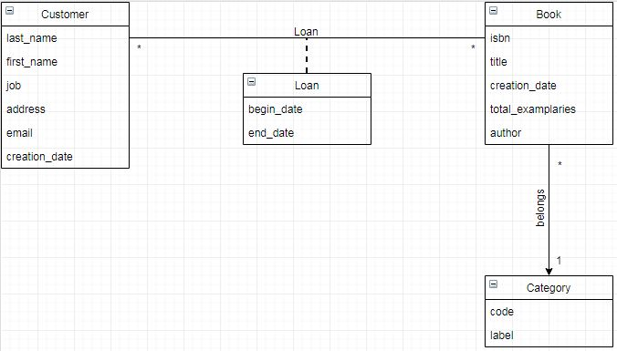

# gestion_des_livres_partie_backend_-Spring_boot

un outil d'administration de bibliothèque ou de gestion de livres. L'objectif est de proposer un outil qui permet à un bibliothécaire la possibilité de gérer l'insertion dans son système, de nouveaux livres, de nouveaux clients et de réaliser des prêts de livres à ces derniers.

